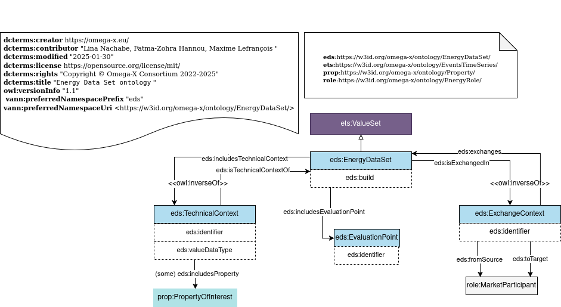

# Energy Dataset Ontology

## Description

### Purpose:
Sharing data resources in complex environments, like in the energy domain, requires some contextual information together with data values to facilitate and ensure consistent interpretation of data exchanges in the dataspace.

### Scope:
The Energy Dataset Ontology provides OWL classes and properties to describe energy datasets. By using this dataset description, the data structure is enriched with contextual information.

### Description:
This Energy Dataset Ontology helps to define datasets in Energy Data Spaces. It adds:
- The **technical context**, which includes the technical standards or communication protocols that govern the dataset exchange.
- The **exchange context**, which includes the participants in the dataset exchange.
- The **evaluation point**, which is attached to the dataset exchange and can be the virtual or physical point where the dataset is assessed, measured, or evaluated.

For example, the dataset containing energy consumption, energy production, and energy imported from the grid could have as an evaluation point the Home Management System (HMS). The technical context could specify how the data is collected, stating that the evaluation point for the energy consumed is the Linky smart meter located at the household.

## Competency Questions

### Querying Questions
| ID    | Question in natural language                                              | Example                                                                                             |
|-------|---------------------------------------------------------------------------|-----------------------------------------------------------------------------------------------------|
| cq-1  | What is the evaluation point of a specific energy dataset?                 | The evaluation point associated with a specific energy dataset, like the weather station associated with a meteorological dataset. |
| cq-2  | What are the properties included in a specific energy dataset?             | The list of properties associated with a specific energy dataset, such as global irradiance.         |
| cq-3  | What are the energy datasets sent by a specific participant?               | The list of energy datasets sent by a specific participant, such as the datasets sent by EDFRD renewable power producers. |
| cq-4  | What is the data type of a specific energy dataset?                        | The value type of a specific energy dataset, like integer or float.                                 |
| cq-5  | What are the energy datasets associated with a specific technical context? | The energy datasets associated with a specific technical context.                                   |

### Inference Questions
| ID    | Question in natural language                                              | Example                                                                                             |
|-------|---------------------------------------------------------------------------|-----------------------------------------------------------------------------------------------------|
| iq-1  | What are the properties associated with an energy dataset?                | The list of properties associated with an energy dataset.                                           |

## Glossary

### Omega-X EDS
* [**eds:_EnergyDataSet_**](https://w3id.org/omega-x/ontology/EnergyDataSet/EnergyDataSet): A group of data exchanged using an Energy Dataspace.
* [**eds:_TechnicalContext_**](https://w3id.org/omega-x/ontology/EnergyDataSet/TechnicalContext): The technical characteristics of the context in which the exchange of data takes place.
* [**eds:_EvaluationPoint_**](https://w3id.org/omega-x/ontology/EnergyDataSet/EvaluationPoint): An evaluation point related to the data exchanged. It can be either a physical or virtual component. An evaluation point can be a smart meter collecting the data or a software compiling the data.
* [**eds:_ExchangeContext_**](https://w3id.org/omega-x/ontology/EnergyDataSet/ExchangeContext): The exchange context, which includes the source and target participants of the data exchange.

## OWL Description

## Recommendations
- A `ets:ValueSet` (see [_ValueSet_](../ [Top Level] Events & Time Series Ontology)) exchanged within the energy data space will be considered as an `eds:EnergyDataSet`.
- An `eds:EvaluationPoint` can be a `infra:SystemOfInterest` (see [_System_](../ [Domain] Infrastructure Ontology)). The properties and connections of the system can be retrieved from (../ Infrastructure Ontology).
- An `eds:EnergyDataSet` can have an `eds:ExchangeContext` sent from a `role:MarketParticipant` to another `role:MarketParticipant` (see [_MarketParticipant_](../ [Domain] Energy Role Ontology)). More details about the market participants can be described in the (../  [Domain] Energy Role Ontology) module.
- More than one `eds:EnergyDataSet` can share the same `eds:ExchangeContext`.
- An `eds:TechnicalContext` will include all properties associated with the data exchange. These properties can be inferred from the relation: `ets:PropertyValue` `prop:isAboutProperty` `prop:Property` in (../  [Top Level] Events & Time Series Ontology) module.
- An `eds:TechnicalContext` can include more than one `eds:EvaluationPoint`.
- An `eds:EvaluationPoint` can be directly associated with an `eds:EnergyDataSet`.
- If more than one `eds:EnergyDataSet` shares the same `eds:EvaluationPoint` and the technical protocol, a `eds:TechnicalContext` can be created, and the `eds:EvaluationPoint` is associated with this `eds:TechnicalContext`.

## Related Work

### EUMED Metering Profile (IEC 61968-9 Ed 3.0)
- **Reading Point**: The identification of an entity where energy products are measured or computed.
- **Measurement Kind**: Identifies "what" is being measured, as a refinement of 'commodity'. When combined with 'unit', it provides detail to the unit of measure.
- **Business Role**: A business role that this organization plays. A single organization typically performs many functions, each one described as a role.
- **Build**: Timestamp of the data exchange.
- A business context is a set of properties that gives some business details on a value set.
- A technical context is a set of properties that gives some technical details on a value set.

### SEAS
- [**_seas:System_**](https://w3id.org/seas/System): The class of systems, i.e., systems virtually isolated from the environment, whose behavior and interactions with the environment are modeled.
- [**_seas:FeatureOfInterest_**](https://w3id.org/seas/FeatureOfInterest): A feature of interest is an abstraction of a real-world phenomenon (thing, person, event, etc.). A feature of interest is then defined in terms of its properties.
