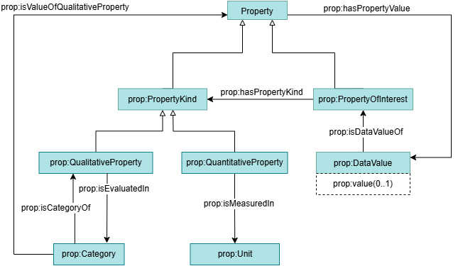

# Domain Ontology: Property

## Description
`Property`, or `Prop`, is a domain level module of the Common Semantic Data Model (CSDM). It provides a taxonomy of energy domain properties. 
The scope of this module extends also to the definition of units and categories associated with properties, and used for values definition.

## Competency Questions
### Querying Questions
| ID | Question in natural language | Example
|---|---|---|
| cq-1 | What are possible values to be associated with a qualitative property ? | Possible values for a qualitative property include the set of values defined in the category in which it is evaluated. |
| cq-2 | What are possible properties that can be associated with a unit of measurement ? | EUR-PER-KiloW-HR is a unit of measurement that can be used for energySellingprice, EnergyBuyingPrice,... |
| cq-3 | What are possible units for measuring a property ? | Temperature property can be measured in Celsus Degrees,  Fahrenheit degrees,... |
| cq-4 | What is the capacity of the battery XYZ ? | Battery capacity is a property of an equiepement with a static value, an numerical value should be associateto the property. |

## Glossary

## OWL Description

## Recommendations
- A `prop:Property` is the upper class for the omega-X property taxonomy. It is further distinguished into `prop:QuantitativeProperty` for properties to which quantitative values are assigned (`prop:Temperature` has as possible values `18`, `19`,..), and `prop:QualitativeProperty` for properties with values defined in a category (eg. `prop:OperatingStatus` has as possible values `On` and `Off`).

- The property taxonomy is defined under the class `prop:PropertyKind` as an hierarchy of `skos:Concept`. Each real-world property (such as a specific temperature or operating status measured or observed) is represented as a `prop:PropertyOfInterest` and is linked to its corresponding kind through the `prop:hasPropertyKind` property.

- The evaluation of properties is described in `Event and Time Series` module, through the `ets:DataValue` class . For dyamic values (chaning over time), a `ets:ValueSet` is created with the entire set of values, following a `ets:TemporalContext`. For static values (stable in time), the object property `prop:hasPropertyValue` enables to indicate one value per property.

- `prop:DataValue` is used for both quantitative values (thorugh datatype property `prop:Value`) or qualitative through the `prop:category` individuals.

- Categorical individuals of type `prop:Category` are used as property values `ets:PropertyValue` in case of qualitative Datasets.

## **Verisons compatibility**
- This version 1.1 distinguishes property kinds from properties of interests which remains compatible with previous version where both where under property. It enables to provide more descriptions about the properties.

- Static values are introduced thourgh `prop:DataValue` when previous version used `ets:DataValue` now exclusively dedicated for dynamic values. Both classes are valid (equivalent) for property evaluation but it is recommended to use separate classes for different purposes.  