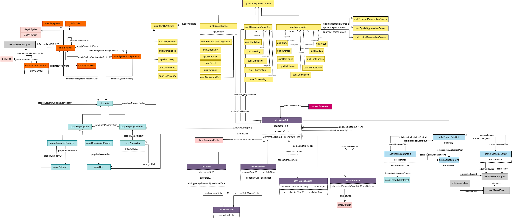

# Omega-X Ontology Repository

Welcome to the Omega-X Ontology repository! 
The repository hosts the two versions of the CSDM (Common Semantic Data Model) 1.0 and 1.1. Latest version published on May 2025.

## Repository Structure

The repository structure is built to fit multi-level modular ontologies, following the ACIMOV ontology developement methodology. 
It hosts also relevant alignements to external resources (ontologies/standards). 

The tooling section includes automation scripts for various tasks: ontology building, documentation release, semantic validation, data semantization...

The omega-X ontology is defined by twelve modules: a top_level ontology for Events and Time Series (ETS), 7 domain ontolog modulesy for Energy domaines, and 4 Use case family ontology modules. 

```
📂 Omega-X Ontology 
│
├─ 📁 EventsTimeSeriesOntology
│   ├── 📄 EventsTimeSeriesOntology-v.ttl       /* T-box at version v
│   ├── 🖼️ EventsTimeSeries-v.png        /* eg. CHOWLK diagram at version **v**
│   ├── ❓ cq-Q.rq                 /* Optional, a set of Competency questions translated as Sparql queries.
│   └── 📄 README.md
│
├─ 📁 ModuleNameOntology
│   ├── 📄 ModuleNameOntology.ttl               /* T-box
│   ├── 🖼️ diagram.<imgFormat>  /* eg. CHOWLK diagram
│   ├── ❓ cq-Q.rq              /* A set of Competency questions translated as Sparql queries.
│   └── 📄 README.md
│
├─ 📁 Docs
│   ├── 📄 ModuleName.html               /* Main documentation web page for the module
│   ├── 🖼️ diagram.<imgFormat>  /* eg. Required images for the documentation
│
├─ 📁 Tooling
│   ├── 📁 [Demonstration]          /* Examples of demonstration implementing CSDM
│   ├── 📁 SHACL                  /* Example of Shacl constraints and validation 
│   ├── 📁 Semantisation         /* Tutorial of the semantisation feature using CSDM
│   └── 📄 README.md
│
├─ 📁 External Resources
│   ├── 📁 EUMED Metering
│   ├── 📄 onto.ttl              /* T-box of a considered external ontology 
│   │   ├── 📁 Alignements      /* Alignement between the external resource and Omega-X ontology.
│   └── 📄 README.md
│
├─ 📄 README.md
├─ 📄 Omega-X-v.ttl             /* Main T-box of the ontology (importing all modules)
├─ 📄 Omega-X-v.drawio          /* Main CHOWLK diagram source
```

## List of modules 
Group Name| Module | Scope |State
|---|---|---|---|
|Top Level | [Events and Time Series (ETS)](./[Top Level] Events & Time Series Ontology) | ETS ontology provides classes and properties to allow commonly used data structures to be described. | V 1.1
|Domain | Energy Data Set (EDS) | EDS ontology extends ETS definitions with specefic energy domain context (both technical and business). | V 1.1
|Domain | Eumed Metering (EME) | EME ontology is a semantisation of the Eumed metering profile of the CIM standard. | v1.1
|Domain | Property (PROP) | PROP ontology provides a taxonomy of properties used in the energy domain. | v1.1
|Domain | Infrastructure (INFRA) | INFRA ontology provides a common description for systems infrastructures in the energy domain, to be further specialiazed in UC ontologies. | v1.1
|Domain | Actor role (ROLE) | ROLE ontology provides a description of business entities roles in the dataspace and in their business activities. | v1.1
|Domain | Quality (QUAL) | QUAL ontology provides a taxonomy of quality indicators associated with datasets. | v1.1
|Domain | Scheduling (SCHE) | SCHE ontology provides a common description of schedules. | v1.1
|Use Case Family | Renewable (REN) | REN is the use case ontology for the renewables use case family. | V1.1
|Use Case Family | Flexibility (FLEX) | FLEX is the use case ontology for the flexibility use case family. | V1.1
|Use Case Family | Local Energy Communities (LEC) | LEC is the use case ontology for the lec use case family. | V1.1
|Use Case Family | Electromobility (EM) | EM is the use case ontology for the electromobility use case family. | V1.1

## Overview of common modules

The figure below illustrates common modules (Top level and domain modules). The online diagram version is available here : 
[Common Modules Diagram](https://app.diagrams.net/#G1q05sxDvyCEwQj_UCIHW11u9iUm4L0wDy#%7B%22pageId%22%3A%22oPHg0NIDeMugmmmMHvXY%22%7D)




## Utils

- Ontology diagrams can be defined using CHOWLK [diagram.net](https://app.diagrams.net/). A library for specific ontology conceptualisation is available here [CHOWLK Ontology library](https://chowlk.linkeddata.es/). To learn more about visual notation specification, see: [CHOWLK Documentation](https://chowlk.linkeddata.es/notation.html). 

## License

This project is licensed under the MIT License. See the [LICENSE](./LICENSE) file for details.


