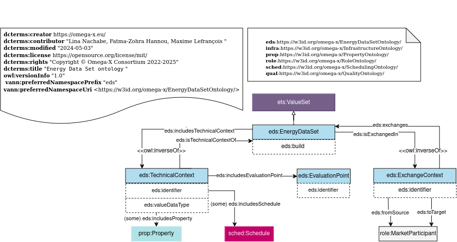

# Energy Data Set Ontology

## Description
### Purpose:
Sharing data resources in complex environments like in the case of energy domain requires some contextual information together with data values to facilitate and ensure consistent interpretation of data exchange in the dataspace. 
### Scope:
Energy Data Set ontology provides OWL classes and properties to allow energy data sets to be described. The use of a dataset description enriches the data structure description with contextual information.
### Description:
This Energy Data set Ontology helps to define data sets in Energy Data Spaces. It adds:
- the technical context as the property, the schedule, and the quality associated to an energy data set.
- the exchange context as the participants of the data exchange.
- the evaluation point attached to the data set exchange.

## Competency Questions

### Querying Questions
| ID | Question in natural language | Example
|---|---|---|
| cq-1 |What is the evaluation point of a specifc energy data set?  | The evaluation point associated to a specific energy data set like the weather station associated to a meteolological data set.|
| cq-2 |What are the properties included in a sepcific  energy data set?   | The list of properties  associated to a specific energy data set like the global irradiance.|
| cq-3 | What are the energy data sets sent by a specific partcipant?  | The list of energy data sets sent by a specific participant for example the energy data sets sent by EDFRD renewable power producer.|
| cq-4 |  What is the value data type of a specific energy data set?  | The value type of a specific energy data set like integer, float,...|
| cq-5 |  What is the technical context associated to a specific energy data set?  | The technical context associated to a specific energy data set .|
### Inference Questions
| ID | Question in natural language | Example
|---|---|---|
| iq-1| What are the properties associated to an energy data set? | The list of properties associated to an energy data set.|

## Glossary
### Omega-X EDS
* [**eds:_EnergyDataSet_**](https://w3id.org/omega-x/EnergyDataSetOntology/EnergyDataSet/)
Group of data exchanged using an Energy Dataspace. 
* [**eds:_TechnicalContext_**](https://w3id.org/omega-x/EnergyDataSetOntology/TechnicalContext/)
Technical characteristics of the context where the exchange of data takes place.
* [**eds:_EvaluationPoint_**](https://w3id.org/omega-x/EnergyDataSetOntology/EvaluationPoint/)
Evaluation point concerned by the data exchanged. It can be either a physical or virtual component. An evaluation point can be a smart meter collecting the data or a software compiling the data.
* [**eds:_ExchangeContext_**](https://w3id.org/omega-x/EnergyDataSetOntology/ExchangeContext/)
Exchange context where the exchange of data takes place inluding the source and target particpants of the exchange.
## OWL Description

## Recommendations
- A `ets:ValueSet` (see [_ValueSet_](../  [Top Level] Events & Time Series Ontology)) exchanged within the energy data space will be considered as an energy data set`eds:EnergyDataSet`. 
- An `eds:EvaluationPoint` can be a `infra:System` (see [_System_](../ [Domain] Infrastructure Ontology)). The properties and connections of the system can be retreived from (../  Infrastructure Ontology).
- A `eds:EnergyDataSet` can have `eds:ContextExchange` sent from a `role:MarketParticipant` to another `role:MarketParticpant` (see [_MarkeParticipant_](../  [Domain] Energy Role Ontology)). More details about the market participants can be described in (../  [Domain] Energy Role Ontology) module.
- A `eds:TechnicalContext` will include all the properties associated to the data exchange. These properties can be inferred from the relation: of `ets:PropertyValue` `prop:isAboutProperty` `prop:Property` in  (../  [Top Level] Events & Time Series Ontology) module.
## Related Work
### EUMED Metering profile (IEC 61968-9 Ed 3.0)
* Evaluation point: The identification of an entity where energy products are measured or computed.

* Measurement kind: Identifies "what" is being measured, as refinement of 'commodity'. When
combined with 'unit', it provides detail to the unit of measure.
* Business Role: A business role that this organisation plays. A single organisation
typically performs many functions, each one described as a role.
* build: Time stamp of the data exchange.
* A business context is a set of properties that gives some business details on a value set.
* A technical context is a set of properties that gives some technical details on a value set.

### SEAS
 [**_seas:System**](https://w3id.org/seas/System): The class of systems, i.e., systems virtually isolated from the environment, whose behaviour and interactions with the environment are modeled.
 [**_seas:FeatureOfInterest**](https://w3id.org/seas/FeatureOfInterest): A feature of interest is an abstraction of a real world phenomena (thing, person, event, etc). A feature of interest is then defined in terms of its properties.

